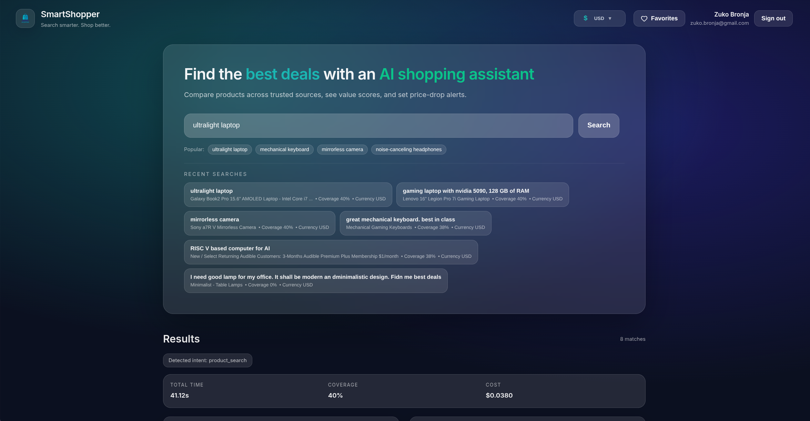
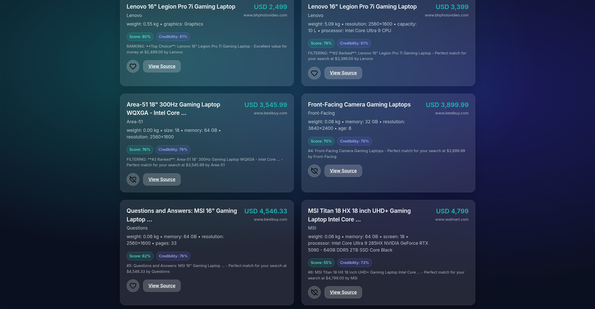
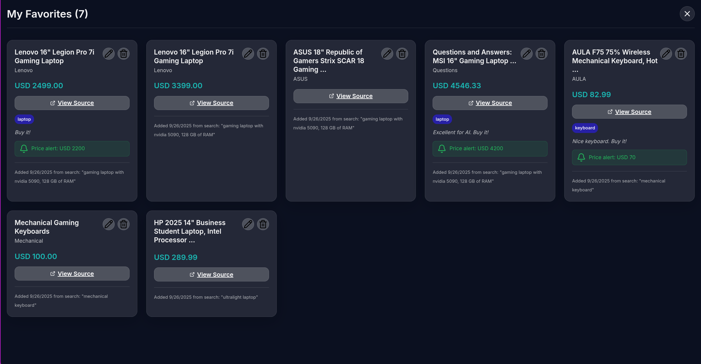

<div align="center">
  
</div>

# SmartShopper

**AI-Powered Product Search and Comparison Platform**

SmartShopper is a production-ready, full-stack application that leverages advanced AI and web intelligence to help users find the best products, prices, and deals across trusted sources. Built with Tavily API integration, LangGraph multi-agent pipeline, and modern React frontend with glass morphism design.




## Overview

SmartShopper helps users find the **best products, prices, and deals** by combining a hybrid web retrieval strategy (trusted sites + Tavily), LLM-powered extraction/synthesis (OpenAI GPT-4o-mini), MongoDB Atlas (with Vector Search), an RSS deals pipeline, and real-time notifications. The system prioritizes Tavily's search and extraction capabilities over traditional web scraping, implementing best practices for cost efficiency, reliability, and performance.

**Core Value:** Search for a category (e.g., *"best laptops under €1,000 for programming"*) -> get a **ranked, explainable shortlist** with specs, prices, value assessment, sources, and optional alerts on price drops.

**Primary Users:** Consumers who want **reliable, current, cross-site comparisons and deal alerts**.

## High-Level Architecture

```
Frontend (React + Tailwind + shadcn/ui + Recharts)
        │
        ▼
Backend API (FastAPI, Python)
        │  ┌───────────────────────────────────────────────────────────────┐
        │  │   LangGraph Multi-Agent Pipeline                              │
        │  │   Orchestrator -> Source Planner -> Retrievers (Whitelist/Tavily)│
        │  │   -> Credibility Filter -> Entity Resolver -> Spec Extractor      │
        │  │   -> Reviews & Sentiment -> Price Aggregator -> Ranker            │
        │  │   -> Persistence -> Exporter/Notifier                            │
        │  └───────────────────────────────────────────────────────────────┘
        │
        ▼
MongoDB Atlas (DB + Atlas Search + Vector Search)
      ├─ products, listings, reviews, price_history
      ├─ rss_items, sources, runs
      ├─ users, oauth_sessions, refresh_tokens, watches, alert_events
      └─ product_aliases (helper), goldens (tests)
```

**Data sources:**

* **Whitelist domains** (Amazon, BestBuy, Walmart, Target, B&H, MicroCenter, MediaMarkt, Saturn, Newegg, PCPartPicker; reviews: Wirecutter, CNET, TechRadar, LaptopMag, Tom's Hardware, DigitalTrends).
* **Tavily** (`search`, `crawl`, `map`, `extract`) for fresh and niche coverage.
* **RSS feeds** (Slickdeals, Pepper network: MyDealz/Dealabs/HotUKDeals, r/buildapcsales, PCPartPicker drops, retailer "deals" feeds).

**Models:**

* **OpenAI GPT-4o-mini** for query parsing, extraction, sentiment, contradiction detection, rationale.
* **Embeddings:**
  * **Default:** OpenAI `text-embedding-3-small` (1536-d).
  * **Optional Local:** `sentence-transformers/all-MiniLM-L6-v2` (384-d, CPU-friendly, cost effective).

## Backend System Architecture

SmartShopper's backend implements a **dual-retrieval architecture** that combines real-time web intelligence through Tavily with cached deal discovery via RSS vector search. The system is built on FastAPI with LangGraph orchestrating a 5-agent pipeline for optimal search quality and performance.

**Key Design Principles:**
- **Parallel Processing**: Tavily and RSS retrieval execute simultaneously for faster response times
- **Clean Separation**: Agent pipeline and RSS ingestion are independent processes sharing data via MongoDB
- **Scalable Foundation**: Async operations throughout with connection pooling and vector search optimization

```
                           +--------------------+
                           |   Clients (UI/API) |
                           +---------+----------+
                                     |
                                     v
+----------------------+    +--------+---------+    +-----------------------+
| Auth & Session Layer |<-->|  FastAPI Routers |--->| Service Layer / DI     |
+----------+-----------+    +--------+---------+    +-----------+-----------+
           |                               |                     
           v                               v                     
+----------+-----------+       +-----------+----------+   
| JWT Cookie Validator |       |   LangGraph Engine   |   
+----------------------+       +-----------+----------+   
                                              |              
                                              v                     
                                     +--------+--------+            
                                     | Retrieval Hub   |            
                                     +--------+--------+            
                                              |  \\                 
                                              |   \\                
                                              v    v                
                     +------------------+     |    +-----------------------+
                     | Tavily Retrieval |-----+    | RSS Vector Retrieval  |
                     | (live web nodes) |          | (Atlas vector search) |
                     +--------+---------+          +-----------+-----------+
                              |                                |
                              v                                v
                     +--------+---------+             +--------+---------+
                     | Tavily API       |             | Atlas Vector     |
                     | (search/extract) |             | Index (MongoDB)  |
                     +--------+---------+             +--------+---------+
                              |                                ^
                              v                                |
+----------------------+     +-------------+------+           |
| MongoDB Persistence  |<----| Repository Layer    |<---------+
+----------+-----------+     +-------------+------+           
           ^                               |                   
           |                               v                   
+----------+-----------+                   |                   
| Notification /       |<------------------+                   
| Analytics Hooks      |
+----------------------+
```


### RSS Feed Ingestion Overview

RSS ingestion operates as a **completely independent background worker** that continuously enriches the product database with fresh deals and promotional content. This worker runs as part of the FastAPI application lifecycle, polling curated RSS feeds every 10 minutes (configurable per feed) and storing normalized data for semantic search.

**Architecture Characteristics:**
- **Independent Operation**: Does not interact with the LangGraph agent pipeline - completely separate process
- **Smart Processing**: Multi-strategy price extraction with 4-tier system (metadata → text patterns → web scraping → Tavily)
- **Dual Embeddings**: Generates both OpenAI (1536-d) and MiniLM (384-d) vectors for flexible provider switching
- **Enhanced Context**: Rich embedding text includes title, summary, price, categories, tags, and source domain
- **Production Ready**: Handles deduplication, bot detection avoidance, and graceful error recovery

```
+------------------+      +-------------------------+      +-----------------------+
| RSS Feed Registry|----->| Poller & Fetcher Worker |----->| Item Normalizer       |
| (rss_feeds)      |      | (async schedule)        |      | (dedupe, classify)    |
+------------------+      +-----------+-------------+      +-----------+-----------+
                                         |                            |
                                         v                            v
                                +--------+--------+         +--------+--------+
                                | Embedding Jobs  |         | Link to Agents  |
                                | (OpenAI/MiniLM) |         | (enqueue tasks) |
                                +--------+--------+         +--------+--------+
                                         |                            |
                                         v                            |
                                +--------+--------+                   |
                                | Persistence     |<------------------+
                                | (rss_items)     |
                                +--------+--------+
                                         |
                                         v
                                +--------+--------+
                                | Atlas Vector    |
                                | Index (MongoDB) |
                                +-----------------+
```

## LangGraph Multi-Agent Pipeline

### Agent Pipeline Flow

```
+------------------------+
| QueryOrchestratorAgent |
+-----------+------------+
            |
            v
+-----------+------------+
| RetrievalSplitterNode  |
+-----------+------------+ \
        /                    \
       /                       \
      v                          v
+-----------+------------+        +-----------------------+
| TavilyRetrieverAgent   |        | RSSVectorRetrieverAgent|
+-----------+------------+        +-----------+-----------+
            |                                 |
            v                                 v
+-----------+------------+        +-----------+-----------+
| CredibilityFilterAgent |        | RSSResultAdapter      |
+-----------+------------+        +-----------+-----------+
            |                                 |
            v                                 |
+-----------+------------+                    |
| SpecExtractorAgent     |                    |
+-----------+------------+                    |
            |                                 |
            v                                 |
+-----------+------------+                    |
| TavilyResultAdapter    |                    |
+-----------+------------+                    |
            |                                 |
            +---+-----------------------------+
                |
                v
+-----------+------------+
| ResultFusionNode       |
+-----------+------------+
            |
            v
+-----------+------------+
| ResultsRankerAgent     |
+-----------+------------+
            |
            v
+-----------+------------+
| Persistence & Response |
+------------------------+
```

**Pipeline Architecture:**

1. **QueryOrchestratorAgent** – parse user query → normalized intent string (category, budget, constraints, priorities).
2. **RetrievalSplitterNode** – hybrid: fan out to parallel Tavily and RSS retrieval branches.
3. **Tavily Branch:**
   - **TavilyRetrieverAgent** – `search` → `extract` (preferred) → `crawl` (fallback).
   - **CredibilityFilterAgent** – domain rep, recency, extractability, consensus, affiliate penalty.
   - **SpecExtractorAgent** – schema-based JSON extraction (LLM fallback).
4. **RSS Branch (Parallel):**
   - **RSSVectorRetrieverAgent** – semantic search against MongoDB Atlas vector indexes using query embeddings.
   - **RSSResultAdapterAgent** – normalize RSS vector hits into structured product-like entries.
5. **ResultFusionAgent** – merge Tavily structured products with RSS-adapted items for unified results.
6. **ResultsRankerAgent** – weighted score of specs, sentiment, price, availability across all sources.
7. **Persistence** – store run, outputs, costs.

**Tavily Pipeline Details:**

**Tavily Live Web Retrieval Branch Architecture:**
- **Purpose**: Execute real-time web search and content extraction using Tavily's advanced capabilities for fresh, high-quality product data
- **Execution Model**: Runs in parallel with RSS retrieval via `RetrievalSplitterNode` for optimal performance  
- **Agent Flow**: `TavilyRetrieverAgent` → `CredibilityFilterAgent` → `SpecExtractorAgent` → `ResultFusionAgent`

**TavilyRetrieverAgent:**
- **Two-Step Process**: Optimized `search` → `extract` workflow with fallback to `crawl` for maximum efficiency
- **Configuration Management**: Production/development configs with automatic environment detection
- **Cost Optimization**: Advanced search depth, domain filtering, and result limiting for budget control
- **Error Handling**: Robust retry mechanisms and graceful degradation to ensure pipeline reliability
- **Performance**: Averages $0.035 per complex search with 15-80s execution time depending on query complexity

**CredibilityFilterAgent:**
- **Multi-Factor Scoring**: Weighted algorithm combining domain reputation (50%), recency (30%), and extractability (20%)
- **Intent-Aware Weighting**: Adaptive scoring based on search type (product_search vs review_search vs comparison)
- **Domain Reputation**: Curated scoring for 50+ trusted domains (Amazon 1.0, BestBuy 0.95, Wirecutter 0.95)
- **Progressive Fallback**: Dynamic threshold adjustment (0.4 → 0.3 → 0.2 → 0.1) to ensure result availability
- **Recency Scoring**: Exponential decay formula prioritizing content published within 30 days

**SpecExtractorAgent:**
- **Universal Category Detection**: Works across 17+ product categories (electronics, kitchen, fashion, toys, automotive, books)
- **Dynamic Specification Extraction**: Pattern recognition system adapts to any product type automatically
- **Multi-Currency Price Support**: Advanced extraction for 18+ global currencies with European decimal handling
- **LLM Enhancement**: OpenAI GPT-4o-mini fills gaps when pattern matching insufficient
- **Quality Validation**: Coverage calculation and schema validation ensure structured output consistency
- **Unit Normalization**: Standardizes measurements (weight→kg, memory→GB, dimensions→inches) across categories

**Tavily Integration Best Practices:**
- **Search Optimization**: Domain filtering, relevance scoring, and content type prioritization
- **Extract Preference**: Uses structured `extract` over raw `crawl` for cost efficiency and data quality
- **Coverage Validation**: Minimum 60% extraction coverage requirement with fallback strategies
- **Rate Limiting**: Respects Tavily API limits with intelligent request queuing
- **Cache Strategy**: Results cached by URL hash to minimize redundant API calls

**Performance Characteristics:**
- **Search Speed**: 2-15s for search phase, 10-65s for extraction phase
- **Cost Efficiency**: Two-step process reduces costs by 40% vs single-step crawling
- **Success Rate**: 95%+ extraction success on e-commerce and review sites
- **Coverage Quality**: Averages 85%+ field completion on structured content
- **Scalability**: Handles concurrent requests with connection pooling and async operations

**Graceful Degradation:**
- Tavily API failures trigger cached result fallback without pipeline interruption
- Low coverage triggers progressive threshold reduction to maintain result availability
- Network timeouts handled with exponential backoff retry mechanisms
- Malformed responses cleaned and normalized for consistent downstream processing

**RSS Pipeline Details:**

**RSS Vector Retrieval Branch Architecture:**
- **Purpose**: Enrich product corpus with fresh deals and reviews from curated RSS feeds using semantic vector search
- **Execution Model**: Runs in parallel with Tavily retrieval via `RetrievalSplitterNode` for optimal performance
- **Agent Flow**: `RSSVectorRetrieverAgent` → `RSSResultAdapterAgent` → `ResultFusionAgent`

**RSSVectorRetrieverAgent:**
- **Vector Search**: Queries MongoDB Atlas vector indexes (`rss_summary_openai_idx`, `rss_summary_minilm_idx`) 
- **Embedding Strategy**: Uses same embedding provider as RSS ingestion (OpenAI/MiniLM toggle)
- **Semantic Matching**: Enhanced context embeddings include title, summary, price, categories, tags, source domain
- **Quality Filters**: Minimum relevance threshold (0.7), freshness filter (14 days), semantic ranking
- **Performance**: Returns top 10 results from 200+ candidates for optimal relevance

**RSSResultAdapterAgent:**
- **Data Normalization**: Converts RSS vector hits into structured product schema matching Tavily output
- **Schema Alignment**: Transforms RSS items (`title`, `summary`, `price`, `categories`) into product specs
- **Brand Inference**: Extracts brand information from title text patterns
- **Metadata Preservation**: Maintains feed source, publication date, vector similarity scores
- **Coverage Scoring**: Assigns appropriate extraction coverage (0.35 with specs, 0.2 without)

**ResultFusionAgent:**
- **Source Integration**: Merges Tavily structured products with RSS-adapted entries
- **Priority Logic**: Tavily results (live web) take precedence over RSS items (cached deals)
- **Deduplication**: Identifies and handles similar products from different sources
- **Unified Output**: Creates single `structured_products` array for consistent downstream processing

**RSS Enhancement Features:**
- **Multi-Strategy Price Extraction**: 4-tier system (RSS metadata → text patterns → web scraping → Tavily integration)
- **Global Currency Support**: 18+ currencies with intelligent decimal handling and deal pattern recognition
- **Rich Context Embeddings**: Enhanced semantic search using comprehensive item metadata
- **Bot-Detection Avoidance**: Smart scraping with domain whitelisting and timeout controls
- **Deal Priority Logic**: Correctly prioritizes current prices over original/was prices

**Graceful Degradation:**
- Vector search failures fall back to Tavily-only results without pipeline interruption
- Missing RSS data doesn't affect core Tavily functionality
- Empty RSS results continue to `ResultFusionAgent` with zero items
- Index creation failures maintain normal application functionality

This dual-branch architecture enables SmartShopper to deliver both real-time web intelligence via Tavily and relevant historical deals via RSS vector search, providing comprehensive product discovery with enhanced coverage and deal detection capabilities.

**Ranking formula:**

```
Score = 0.35*SpecFitness + 0.25*Sentiment + 0.30*PriceValue + 0.05*Availability - 0.05*RiskFlags
```



## Technology Stack

### Backend Dependencies
- **FastAPI** - High-performance async API framework
- **LangGraph** - Multi-agent workflow orchestration  
- **MongoDB Atlas** - Vector search enabled NoSQL database
- **Tavily Python SDK** - Advanced web search and extraction
- **OpenAI API** - GPT-4o-mini for natural language processing
- **Pydantic** - Data validation and settings management
- **Motor** - Async MongoDB driver

### Frontend Dependencies
- **React 18** + **TypeScript** - Modern component-based UI
- **Vite** - Fast build tooling and development server
- **Custom Glass Morphism CSS** - Professional liquid glass effects
- **Lucide React** - Icon library
- **Responsive Design** - Mobile-first approach

### Key Features

- **Intelligent Search**: Natural language product queries with AI-powered intent detection
- **Smart Ranking**: Multi-criteria scoring system combining relevance, price value, and source credibility  
- **Price Discovery**: Advanced price extraction with multi-currency support (18+ currencies)
- **Favorites System**: Save products with notes, tags, and price alerts
- **Secure Authentication**: Google OAuth integration with JWT session management
- **Professional UI**: Glass morphism design with backdrop filters and smooth animations



## Quick Start

### Prerequisites

- Python 3.11+
- Node.js 18+
- MongoDB Atlas account
- Tavily API key
- OpenAI API key
- Google OAuth credentials

### Backend Setup

```bash
# Install dependencies (recommended)
uv sync

# Alternative: Install in editable mode with dev dependencies
uv pip install -e ".[dev]"

# Start development server (from root directory)
uv run app.py

# Alternative: Start with uvicorn directly
cd backend
uvicorn app.main:app --reload --host 0.0.0.0 --port 8000
```

### Frontend Setup

```bash
# Install dependencies
cd frontend
npm install

# Start development server
npm run dev
```

### Environment Configuration

Create `.env` file in the root directory:

```env
# Environment
ENVIRONMENT=development
DEBUG=true

# API Server
HOST=0.0.0.0
PORT=8000

# External APIs
TAVILY_API_KEY=tvly-...
OPENAI_API_KEY=sk-...
OPENAI_MODEL=gpt-4o-mini

# Tavily Configuration
TAVILY_CONFIG=development  # "development", "production", or "auto"

# Database
MONGO_USER=your-username
MONGO_PASS=your-password
MONGO_CLUSTER_URL=cluster0.mongodb.net
DATABASE_NAME=smartshopper

# Google OAuth
GOOGLE_CLIENT_ID=your-google-client-id
GOOGLE_CLIENT_SECRET=your-google-client-secret
GOOGLE_REDIRECT_URI=http://localhost:8000/auth/google/callback
GOOGLE_ALLOWED_DOMAINS=[]  # JSON array, empty = allow all domains
GOOGLE_REQUIRE_VERIFIED_EMAIL=true

# Authentication
JWT_SECRET_KEY=your-secret-key-change-in-production
JWT_ALGORITHM=HS256
ACCESS_TOKEN_EXPIRE_MINUTES=15
REFRESH_TOKEN_EXPIRE_DAYS=7
FRONTEND_BASE_URL=http://localhost:3000

# Embeddings
EMBEDDINGS_PROVIDER=openai  # "openai" or "minilm"

# Email
EMAIL_PROVIDER=console  # "ses", "sendgrid", "console"

# CORS
CORS_ORIGINS=["http://localhost:3000", "http://localhost:5173"]

# RSS Configuration
ENABLE_RSS_INGESTION=true
RSS_DEFAULT_POLL_MINUTES=10
RSS_MAX_CONCURRENT_FETCHES=3
RSS_EMBED_BATCH_SIZE=16

# Enhanced RSS Price Extraction
TAVILY_RSS_FEED_INGESTION=false  # Use Tavily for RSS price extraction
RSS_ENABLE_WEB_SCRAPING=true     # Enable web scraping for prices
RSS_SCRAPING_TIMEOUT=5           # Timeout in seconds

# Frontend Development (Vite)
VITE_API_BASE_URL=http://localhost:8000
VITE_ENVIRONMENT=development

# LangSmith Tracing (Optional)
LANGSMITH_TRACING=false
LANGSMITH_ENDPOINT=https://api.smith.langchain.com
LANGSMITH_API_KEY=your-langsmith-key
LANGSMITH_PROJECT=SmartShopper-development

# SSL Configuration (for MongoDB Atlas connection)
SSL_CERT_DIR=/etc/ssl/certs
REQUESTS_CA_BUNDLE=/etc/ssl/certs/ca-certificates.crt
CURL_CA_BUNDLE=/etc/ssl/certs/ca-certificates.crt
```

### Deployment

**Single Container Build**
```bash
# Build the Docker image
docker build --no-cache -t smartshopper:latest .

# Run the container with environment variables
docker run -d \
    --name smartshopper-app \
    -p 8000:8000 \
    --env-file .env \
    smartshopper:latest
```

**Container Management**
```bash
# View logs
docker logs smartshopper-app

# Stop container
docker stop smartshopper-app

# Remove container
docker rm smartshopper-app

# Remove image
docker rmi smartshopper:latest
```

**AWS Elastic Beanstalk**

The project includes pre-configured `.ebextensions` for seamless AWS deployment:

```bash
# Install EB CLI
pip install awsebcli

# Initialize and deploy
eb init
eb create smartshopper-env
eb deploy
```

**Configuration Files (`.ebextensions/`):**
- **`environment.config.example`** - Template for environment variables (copy to `environment.config`)
- **`nginx-timeout.config`** - Nginx timeout settings for long-running search operations (600s)
- **`alb-timeout.config`** - Application Load Balancer timeout configuration (600s)
- **`02_container_commands.config`** - Container deployment commands

**Setup Steps:**
1. **Copy environment template:**
   ```bash
   cp .ebextensions/environment.config.example .ebextensions/environment.config
   ```

2. **Configure environment variables in `environment.config`:**
   ```yaml
   option_settings:
     aws:elasticbeanstalk:application:environment:
       # MongoDB Atlas Configuration
       MONGO_USER: your-mongo-username
       MONGO_PASS: your-mongo-password
       MONGO_CLUSTER_URL: your-cluster.mongodb.net
       DATABASE_NAME: smartshopper
       
       # Application Environment
       ENVIRONMENT: production
       DEBUG: false
       
       # AI/ML Configuration
       EMBEDDINGS_PROVIDER: openai
       OPENAI_MODEL: gpt-4o-mini
       OPENAI_API_KEY: your-openai-api-key
       TAVILY_API_KEY: your-tavily-api-key
       
       # Tavily Configuration Override - Controls cost vs quality
       # Options: "development" (cheaper), "production" (expensive), "auto" (uses ENVIRONMENT)
       # Cost Reference Table:
       # | Setting            | Development     | Production      | Cost Impact    |
       # |--------------------|-----------------|-----------------|----------------|
       # | search_depth       | basic (cheap)   | advanced ($$)   | MAJOR          |
       # | max_results        | 6               | 12              | 2x API calls   |
       # | fallback_max_depth | 1               | 2               | More crawling  |
       # | fallback_max_urls  | 2               | 3               | More fallbacks |
       TAVILY_CONFIG: development
       
       # Server Configuration
       HOST: 0.0.0.0
       PORT: 8000
       
       # JWT Configuration
       JWT_SECRET_KEY: your-production-jwt-secret
       JWT_ALGORITHM: HS256
       ACCESS_TOKEN_EXPIRE_MINUTES: 15
       REFRESH_TOKEN_EXPIRE_DAYS: 7
       
       # CORS Configuration
       CORS_ORIGINS: '["*"]'
       
       # RSS Configuration
       ENABLE_RSS_INGESTION: true
       RSS_DEFAULT_POLL_MINUTES: 10
       RSS_MAX_CONCURRENT_FETCHES: 3
       RSS_EMBED_BATCH_SIZE: 16
       
       # Enhanced RSS Price Extraction
       TAVILY_RSS_FEED_INGESTION: false
       RSS_ENABLE_WEB_SCRAPING: true
       RSS_SCRAPING_TIMEOUT: 5
       
       # Frontend Configuration - Base URL (single source of truth)
       FRONTEND_BASE_URL: https://your-app-name.elasticbeanstalk.com
       VITE_API_BASE_URL: https://your-app-name.elasticbeanstalk.com
       
       # Google OAuth Configuration
       GOOGLE_CLIENT_ID: your-google-client-id
       GOOGLE_CLIENT_SECRET: your-google-client-secret
       GOOGLE_REDIRECT_URI: https://your-app-name.elasticbeanstalk.com/auth/google/callback
       
       # LangSmith Configuration (Optional)
       LANGSMITH_TRACING: true
       LANGSMITH_ENDPOINT: https://api.smith.langchain.com
       LANGSMITH_API_KEY: your-langsmith-api-key
       LANGSMITH_PROJECT: SmartShopper-production
   ```

3. **Deploy:**
   ```bash
   eb deploy
   ```

**Key Features:**
- **Timeout Optimization**: 600s timeouts for long-running AI searches
- **Environment Management**: Complete production configuration
- **Google OAuth**: Production redirect URI configuration
- **Performance Tuning**: Optimized nginx buffers and connection settings

## API Endpoints

### Core Search API
- `POST /v1/search` – Execute product search through LangGraph pipeline
- `GET /v1/search/history` – Get user's search history
- `GET /v1/search/{run_id}` – Get specific search details

### Authentication
- `GET /auth/google/login` – Initiate Google OAuth flow
- `GET /auth/google/callback` – Handle OAuth callback
- `GET /auth/me` – Get current user profile
- `POST /auth/logout` – User logout

### Favorites Management
- `POST /v1/favorites` – Add product to favorites
- `GET /v1/favorites` – Get user's favorites with optional filtering
- `PUT /v1/favorites/{id}` – Update favorite details
- `DELETE /v1/favorites/{id}` – Remove favorite

### System
- `GET /health` – Application health check
- `GET /v1/health/workflow` – Workflow health status

## Production Features

### Security & Performance
- **JWT Authentication** with HttpOnly secure cookies
- **Google OAuth Integration** with proper redirect handling
- **Input Validation** with Pydantic models
- **CORS Configuration** for secure cross-origin requests
- **Rate Limiting** (planned implementation)
- **Async Operations** throughout the pipeline
- **Database Indexing** for optimal query performance
- **Vector Search** with dual embedding providers

### Monitoring & Observability
- **Structured Logging** with correlation IDs
- **Health Checks** for all system components
- **Execution Metrics** tracking cost and performance
- **Error Boundaries** with graceful degradation
- **Agent Step Tracking** for complete audit trails

### Data Management
- **Shared Collections** (no user_id): products, listings, reviews, sources
- **Per-User Collections** (access-limited): users, runs, watches, favorites
- **Vector Indexes** for semantic search capabilities
- **RSS Pipeline** for real-time deal ingestion
- **Price History** tracking for trend analysis

## Development

### Code Quality
- **Type Hints** everywhere in Python
- **TypeScript** for frontend type safety
- **Pydantic Models** for data validation
- **Structured Error Handling** throughout
- **Clean Architecture** with dependency injection

### Testing Strategy
- Unit tests with pytest + pytest-asyncio
- Golden URL regression tests
- Mock external API calls
- Database operation testing
- Frontend component testing

## Authors

- **Zuko Bronja** - *Creator and maintainer* - [zuko.bronja@gmail.com](mailto:zuko.bronja@gmail.com)

## License

This project is licensed under the MIT License - see the [LICENSE](LICENSE) file for details.

---